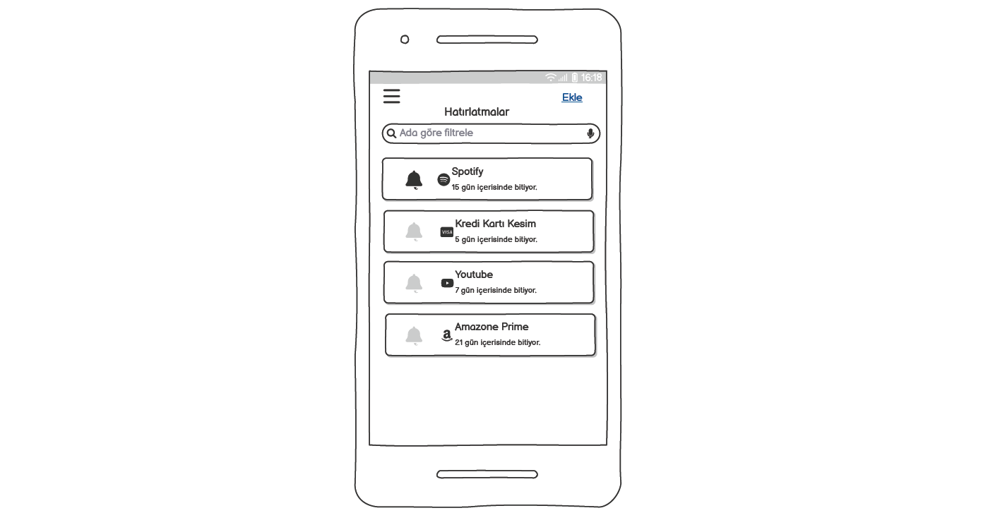

# ToDo List Ekran Tasarim
Balsamiq Wireframe incelemesi için , örnek bir mobil ToDo projesinde ekran tasarımı yapıldı.

## Amaç
Bu doküman, kullanıcıların hatırlatıcılarını yönetebileceği bir ToDo (Yapılacaklar) uygulamasının arayüzünü, ekranlar arası akışını ve temel etkileşimlerini planlamak için hazırlanmıştır.

## Kullanılan Balsamiq Bileşenleri
- Bileşen	Kullanım Amacı
- Button	Kaydet, Sil, Ekle, Giriş Yap gibi işlemler
- Icon	Hatırlatıcı ikonları (Spotify, YouTube vs.)
- Text Input	Kullanıcıdan bilgi alma (Ad, Tarih, Bildirim)
- Dropdown	Tekrar sıklığı, bildirim zamanı seçimi
- Label	Alan adları (Hatırlatma Adı, Tarih, vs.)
- List	Dashboard ekranında hatırlatma listesini göstermek
- Modal/Overlay	Silme onayı gibi pop-up pencereler
- Tab Bar	Alt menü navigasyonu
- Slider/Menu	Sağdan açılan filtre veya işlem menüsü

## Ekran Listesi ve Açıklamaları
Ekran No	Ekran Adı	Açıklama
- 1 Splash Screen	Uygulama logosu ve yüklenme ekranı.
- 2	Dashboard	Tüm hatırlatmaların listelendiği ekran.
  * 2-1	Dashboard Filter Screen	Ada göre filtreleme gibi seçenekler.
  * 2-2	Dashboard Sliding Menu	Menüden değerlendirme, paylaşım gibi işlemler.
- 3	Add Screen	Yeni hatırlatma ekleme ekranı.
 * 3-1	Add Push Notification	Bildirim ayarı belirleme.
 * 3-2	Add Frequency	Günlük, haftalık, özel gibi tekrar ayarları.
- 4	Detail Screen	Hatırlatma detaylarını gösterir.
- 5	Edit Screen	Mevcut hatırlatmayı güncelleme ekranı.
 * 5-1	Edit - Delete Popup	Silme işlemi için onay pop-up’ı.

## Ekran Geçişleri (Wireflow)
- **Splash** → *Dashboard* (otomatik yönlendirme)
- **Dashboard** → *Add* (Ekle butonuyla)
- **Add** → *Add Push Notification & Frequency* (alt ekranlarla açılır)
- **Dashboard** → *Detail* → Edit/Delete
- **Edit** → *Popup ile Silme Onayı*

